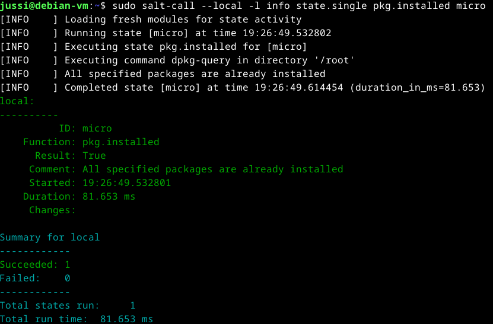
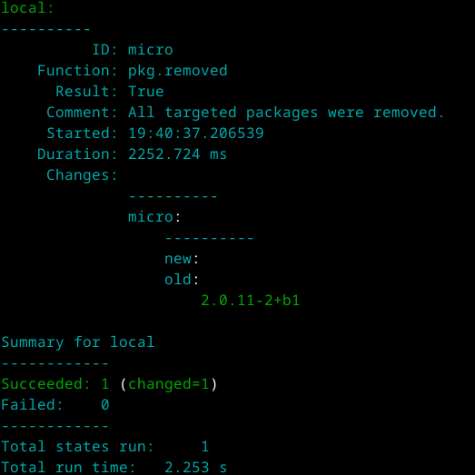
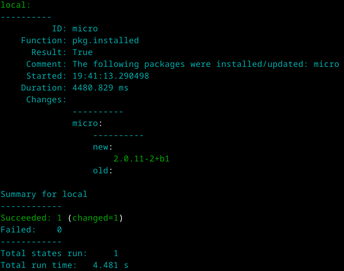
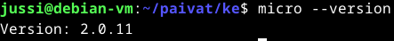
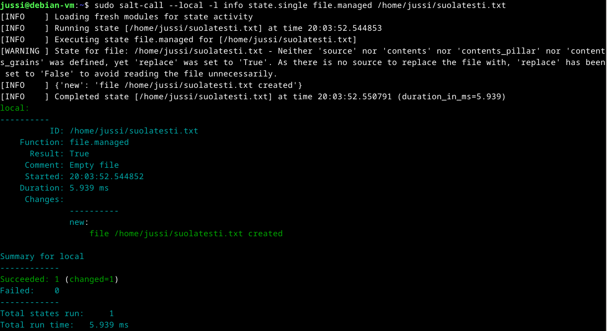
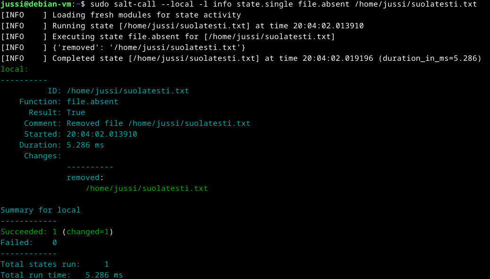
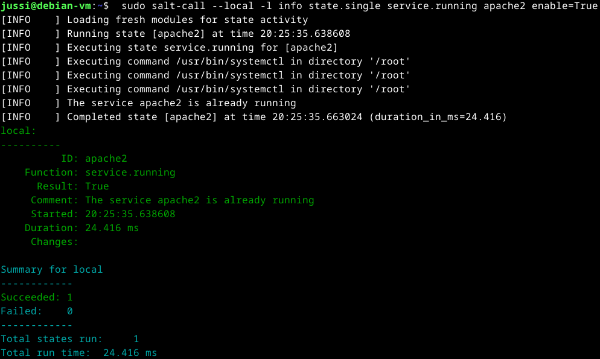
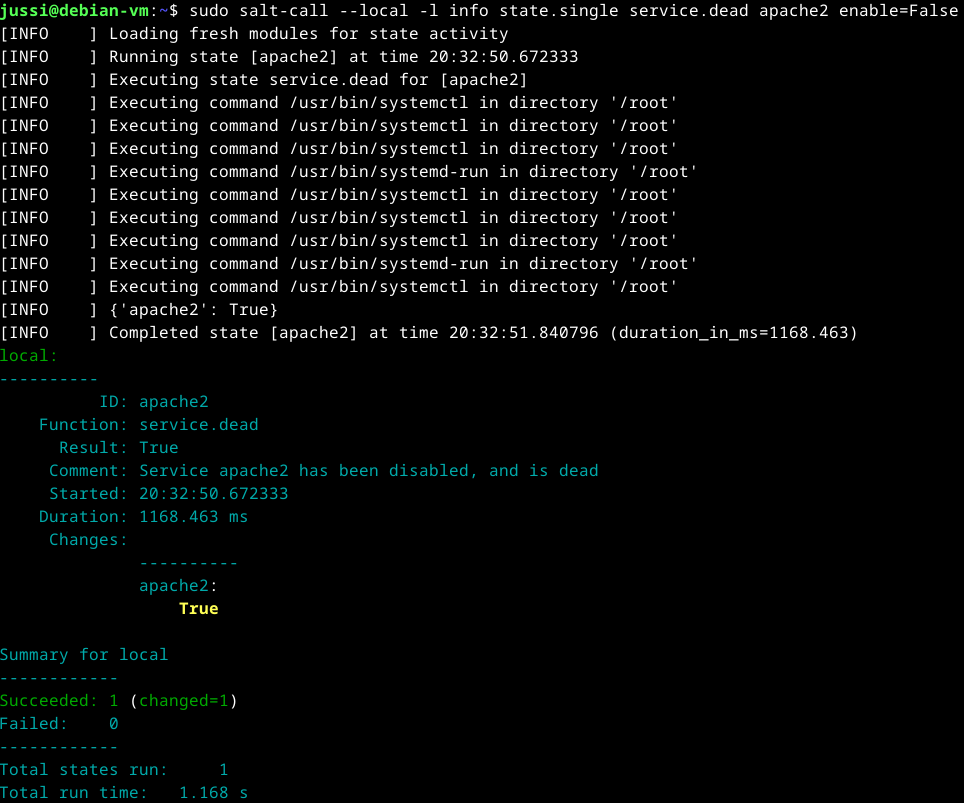
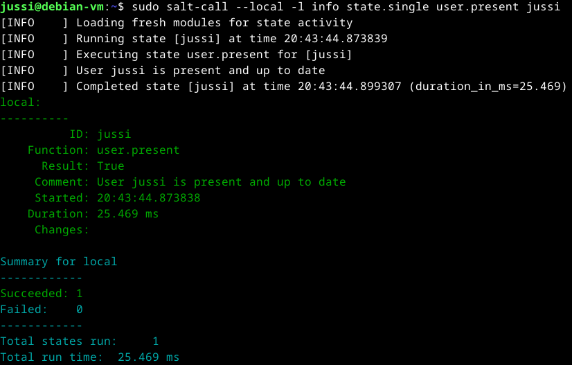
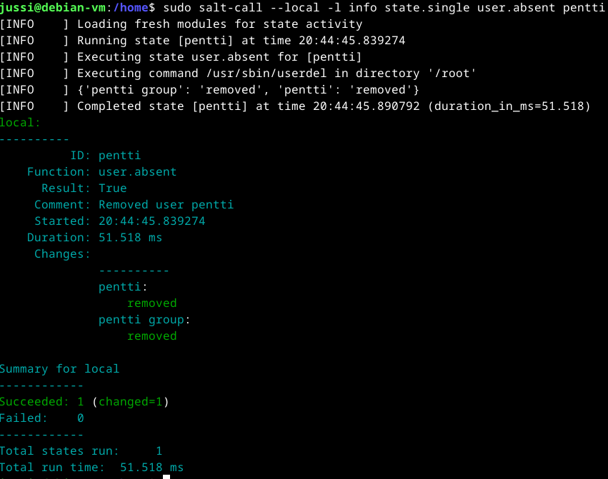

# x) Tiivistelmät
### Verkkosivut githubilla
- Rekisteröidy palveluun.
- Luo säiliö/säilytyspaikka sisällöllesi.
- Tee tehtävät .md tiedostoihin.
- Lisää kuvia.
- Julkaise tekeleesi. 
(Tero Karvinen 2023. <a href="https://terokarvinen.com/2023/create-a-web-page-using-github/">Create a Web Page Using GitHub</a>
### Salt komennot paikallisesti
- Salt minion asennus komennot.
- --local komennot ovat paikallisia komentoja joilla voidaan tarkistaa erilaisia asioita.
- pkg.installed/removed - voidaan tarkistaa ohjelman asennus/poisto komennolla.
- file.managed/absent - voidaan tarkistaa tiedoston olemassaoloa.
- service.running/dead - voidaan tarkistaa ohjelman toimivuutta.
- user.present/absent - voidaan tarkistaa käyttäjien olemassaolo.
- cmd.run - voidaan ajaa ohjelmia.
- Tee idempotentteja suoritteita. Ajetaan vain jos tarvitsee tehdä muutoksia.
- Ohjeita sys.state_doc komennolla. 
(Tero Karvinen 2023. <a href="https://terokarvinen.com/2021/salt-run-command-locally/">Run Salt Command Locally</a>
### a) Salt minion asennus
Käytän debian 12 virtuaalikonetta, virtuaalikoneen lisätiedot ja asennusohje minun raportista -> <a href="https://github.com/JussiMol/Linux-palvelimet/blob/d695d08d28af0854d2a7391a6ad9caa195325762/h1.md"> Linux-palvelimet H1 </a>  
H1 Raportti toteutettu <a href="https://terokarvinen.com/2021/install-debian-on-virtualbox/">Tero Karvisen ohjeita</a> mukaillen.  
Virtuaalikone ollut käyttämättömänä hetken joten päiviteen paketinhallinta.  
$ sudo apt-get update 
$ sudo apt-get upgrade  
Salt minionin asennuksessa seurataan <a href="https://terokarvinen.com/2023/configuration-management-2023-autumn"/>Tehtäväsivun ohjetta </a> H1 osiota "Saltin asennus Debian 12" .  
 

 
 
Ylemmän kuvan komentoja ymmärrän sen verran että, näillä komennoilla tuodaan Salt paketinhallintaan, päivitetään se ja asennetaan ohjelma.  
Ajan kyseiset komennot. Keyrings tiedosto on jo olemassa ensimmäinen komento ei tee mitään.  
Loput toimivat odotetusti ja testataan onko salt asennettuna $ sudo salt-call --version  
 

 
Salt on asennettu onnistuneesti.  
### b) Viisi tärkeintä
Käytetään Tero Karvisen <a href="https://terokarvinen.com/2021/salt-run-command-locally/">ohjeita</a> ja testataan saltin paikallista toimintaa.  
#### pkg.installed/removed
Testataan onko micro teksti editori asennettuna virtuaalikoneella.  
$ sudo salt-call --local -l info state.single pkg.installed micro  
Odotan että tuloste sanoo ettei mikään ole muuttunut koneella ja että editori on asennettuna.  
 

 
ID = micro eli ohjelma mikä oli tapahtuman kohde. 
Function kertoo minkälainen komento ajettiin. Tässä tapauksessa varmistettiin onko mahdollisesti ID:n mukainen ohjelma asennettuna.  
True = tapahtuma on todellinen ja ohjelma asennettu. 
Kaikki paketit asennettuna.  
Aikaleima.  
Kesto millisekunteina. 
Tapahtuman suoritus on onnistunut (succeeded) 
Total states run 1 = ajettiin paikallisesti niin tehtiin vain kerran.  
Ajan vastakkaisen komennon ja muutan pkg.removed micro  
 

 
pkg.removed - nyt poistettiin ohjelma  
Micro old kohdassa on micro editorin versio mikä poistettiin  
Succeeded (changed=1) nyt se kertoo että 1 tapahtuma onnistui - poistimme paikalliselta koneelta micro editorin. 
Testataan onko Micro kadonnut koneelta.  
Yritän avata microlla kotihakemistossa teksti tiedoston -> bash: micro: command not found  
Micro on poistunut.  
Asennan sen takaisin komennolla. $ sudo salt-call --local -l info state.single pkg.installed micro  
 

 
Uusi versio ilmestyi.  
Succeeded (changed=1) Asennus tapahtui?  
Testataan onko micro palautunut koneelle.  
 

 
Micro on asennettu takaisin käyttämällä salt komentoja.  
#### file.managed/absent
Testataan seuraavaksi tiedostojen hallintaa.  
$ sudo salt-call --local -l info state.single file.managed /home/jussi/suolatesti.txt  
 

 
INFO kohdat kertovat meille saltin toimintoja 
WARNING ilmoittaa ettei tiedostolle ole määritetty '' merkkien sisällä nimettyjä ominaisuuksia.  
Komento on luonut meille oman kertomansa mukaan suolatesti.txt tiedoston.  
$ ls ja kotihakemistosta todella löytyy suolatesti.txt tiedosto.  
Kokeillaan poistaa se file.absent komennolla.  
 

 
$ ls ja tiedosto on poistunut kotihakemistosta.  
#### service.running/dead
Testataan ohjelmien komentoja Apache2:lla  
Katsotaan mikä on alkutilanne $ sudo systemctl status apache2 - se on päällä (active) 
$ sudo salt-call --local -l info state.single service.running apache2 enable=True - testataan mitä komento sanoo kun Apache2 on jo päällä.  
 

 
Already running, muutoksia ei tehty.  
Sammutetaan palvelin $ sudo salt-call --local -l info state.single service.dead apache2 enable=False  
 

 
INFO osioista huomataan heti, että salt ajaa enemmän komentoja juurihakemistossa.  
Tappofunktion lopputulos = True  
1 onnistunut tapahtuma ja muuttunut tila.  
Testataan weppipalvelimen tila $ sudo systemctl status apache2 - inactive(dead)  
Testaus selaimella - ei mitään elämää  
service.running komennolla voisin sen laittaa päälle, mutta jätetään pysäytetyksi aiheuttamaan ihmetystä seuraavaa kertaa varten.  
#### user.present/absent
Testataan onko minun käyttäjä olemassa  
$ sudo salt-call --local -l info state.single user.present jussi 
 

 
Onhan se  
Siirryn juurihakemistoon ja katsotaan /home ja ls onko koneella muita käyttäjiä. Pentti löytyy. 
Annetaan pentille kenkää  
 

 
Pentti ja pentti group removed. Poisto onnistui  
