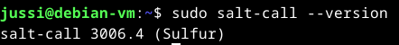

# x) Tiivistelmät
### Verkkosivut githubilla
- Rekisteröidy palveluun.
- Luo säiliö/säilytyspaikka sisällöllesi.
- Tee tehtävät .md tiedostoihin.
- Lisää kuvia.
- Julkaise tekeleesi. 
(Tero Karvinen 2023. <a href="https://terokarvinen.com/2023/create-a-web-page-using-github/">Create a Web Page Using GitHub</a>
### Salt komennot paikallisesti
- Salt minion asennus komennot.
- --local komennot ovat paikallisia komentoja joilla voidaan tarkistaa erilaisia asioita.
- pkg.installed/removed - voidaan tarkistaa ohjelman asennus/poisto komennolla.
- file.managed/absent - voidaan tarkistaa tiedoston olemassaoloa.
- service.running/dead - voidaan tarkistaa ohjelman toimivuutta.
- user.present/absent - voidaan tarkistaa käyttäjien olemassaolo.
- cmd.run - voidaan ajaa ohjelmia.
- Tee idempotentteja suoritteita. Ajetaan vain jos tarvitsee tehdä muutoksia.
- Ohjeita sys.state_doc komennolla. 
(Tero Karvinen 2023. <a href="https://terokarvinen.com/2021/salt-run-command-locally/">Run Salt Command Locally</a>
### a) Salt minion asennus
Käytän debian 12 virtuaalikonetta, virtuaalikoneen lisätiedot ja asennusohje minun raportista -> <a href="https://github.com/JussiMol/Linux-palvelimet/blob/d695d08d28af0854d2a7391a6ad9caa195325762/h1.md"> Linux-palvelimet H1 </a>  
H1 Raportti toteutettu <a href="https://terokarvinen.com/2021/install-debian-on-virtualbox/">Tero Karvisen ohjeita</a> mukaillen.  
Virtuaalikone ollut käyttämättömänä hetken joten päiviteen paketinhallinta.  
$ sudo apt-get update 
$ sudo apt-get upgrade  
Salt minionin asennuksessa seurataan <a href="https://terokarvinen.com/2023/configuration-management-2023-autumn"/>Tehtäväsivun ohjetta </a> H1 osiota "Saltin asennus Debian 12" .  
 

 
Ylemmän kuvan komentoja ymmärrän sen verran että, näillä komennoilla tuodaan Salt paketinhallintaan, päivitetään se ja asennetaan ohjelma.  
Ajan kyseiset komennot. Keyrings tiedosto on jo olemassa ensimmäinen komento ei tee mitään.  
Loput toimivat odotetusti ja testataan onko salt asennettuna $ sudo salt-call --version  
 

 
