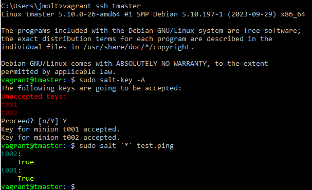

# H2 Karjaa
## x) Tiivistelmät
### Karjaa vai lemmikkejä
- Lemmikit ovat kriittisiä ja tärkeitä palvelimia, joita käsitellään manuaalisesti.
- Karja koostuu monista palvelimista, joita voidaan poistaa ja ottaa uusia käyttöön joustavasti. 
(StackExchange,  <a href="https://devops.stackexchange.com/questions/653/what-is-the-definition-of-cattle-not-pets#654">What is the definition of "cattle not pets"?</a>) 
### Vagrant
- Päivitä paketinhallinta
- Asenna Vagrant ja virtualbox
- Määritä asennettava virtuaalikone (käyttöjärjestelmä) ja yhdistä ssh-yhteydellä.
- Tuhoa 'vagrant destroy' käytön päätteeksi 
(Tero Karvinen, <a href="https://terokarvinen.com/2017/04/11/vagrant-revisited-install-boot-new-virtual-machine-in-31-seconds/">Vagrant Revisited</a>)
### Salt Vagrant
- Palvelinympäristö vaatii Vagrantin, virtualboxin ja tekstieditorin
- Virtualisointi määritellään Vagrantfile tiedostolla, sisältö muokattavissa.
- Ympäristö toimii herra/orja arkkitehtuurilla, orjat vastaavat herralle.
- Orjia voi käskeä komennoilla.
- Orjista voi kerätä tietoa.
- Päämääränä idempotentti lopputila.
- Orjille voidaan syöttää koodia ja ne toimivat sen perusteella. 
(Tero Karvinen, <a href="https://terokarvinen.com/2023/salt-vagrant/">Salt Vagrant - automatically provision one master and two slaves</a>)
### a) Vagrantin asennus
Isäntäkoneella Windows 10 Home 64-bit 
AMD Ryzen 5 5600X 6-Core prosessori  
16 GB RAM 
Vagrant lataus sivulta https://developer.hashicorp.com/vagrant/downloads Windows AMD64 Versio 2.4.0  
Latauksen jälkeen ihan varmuudeksi skannaan Windows Defenderillä ladatun asennusohjelman. 
Ei uhkia, 183913 tiedostoa tarkistettiin.  
Asennusohjelma pyytää hyväksymään käyttöehdot ja lisenssin. 
Asennus tapahtuu järjestelmänhallitsijan oikeuksilla. 
 

 
Asennusohjelma tekee tehtävänsä ja asennus on valmis.  
 

 
Pyytää vielä käynnistämään koneen uudestaan, että kaikki määritykset tulevat voimaan.  
Avaan komentokehotteen ja ruvetaan kokeilemaan.  
Testataan onko ohjelma olemassa  
vagrant --version Vagrant 2.4.0  
Ohjelma on asennettu. 
### b) Yksi maankiertäjä
Kokeillaan <a href="https://terokarvinen.com/2017/04/11/vagrant-revisited-install-boot-new-virtual-machine-in-31-seconds/">Vagrant Revisited</a> ohjeita ja katsotaan mitä käy.  
 

 
Okei ohjelma loi automaattisen Vagrantfilen, etsitään se näin alkuun.  
Löytyi käyttäjän omasta hakemistosta, katsotaan sisältö.  
 

 
Loput tiedostosta on kommenttirivejä, jotka selittävät eri osien toimintaa ja ohjeita.  
config.vm.box = "debian-12" Kokeillaan tapahtuuko vagrant up komennolla mitään.  
 

 
Eipä onnistunut. Etsitään ratkaisu. <a href="https://developer.hashicorp.com/vagrant/tutorials/getting-started">Vagrant Quick start</a>  
Ohjeita seuraamalla pitäisi tehdä hakemisto johon sijoitetaan projekti ja vagrant init komento tekisi sinne valmiin Vagrantfilen.  
///Vagrantfile luodaan siihen hakemistoon, jossa olet kun ajat vagrant init komennon/// 
hashicorp/bionic64 on joku hashicorpin oma "box", joka löytyy pilvestä.  
Kokeillaan omaa soveltamista. <a href="https://terokarvinen.com/2023/salt-vagrant/">Teron ohjeita</a> ja omaa Vagrantfileä vertaamalla huomasin mikä itsellä taisi mennä vikaan.  
 

 
Muutan "debian-12" -> "debian/bookworm" ja ajan uudestaan vagrant up.  
Sama virheilmoitus kuin äsken nimet vain vaihtuivat. Teron ohjeissa lukee "bullseye64" ja omassa ei. Lisätään se ja uusi vagrant up ajo.   
Noniin, nyt alkoi tapahtua. Komentokehotteen teksti liian pitkä kuvan ottamiseen. Tarkistetaan virtualboxista onko kone päällä.  
 

 
Ilmeisesti Vagrant hakee siltikin pilvestä tuon minun "boxin" <a href="https://app.vagrantup.com/boxes/search?utf8=%E2%9C%93&sort=downloads&provider=&q=debian+bookworm">Discover Vagrant Boxes</a> sivulta löytyi alle kuukausi sitten tehty debian/bookworm64 boxi.  
No testataan saadaanko koneeseen ssh yhteys.  
 

 
B tehtävä onnistui. exit komennolla ulos virtuaalikoneesta ja vagrant destroy komennolla sen poisto.  
### c) Oma orjansa
Muokataan Vagrantfilen sisältöä. <a href="https://terokarvinen.com/2023/salt-vagrant/">Teron ohjeista</a> jätän toisen t002 koneen pois, vaihdan bullseye64 -> bookworm64. Loppuihin en koske.  
Katsotaan mitä tapahtuu - vagrant up  
Komentokehoteesta poimittuja huomioita.  
Molemmat koneet herra ja orja päivittävät suoraan asennuksessa paketinhallinnan.  
t001: ssh address 127.0.0.1:2222 ja tmaster: ssh address 127.0.0.1:2200  
Matching MAC address for NAT networking.  
Kokeillaan ottaa ssh yhteys herraan. vagrant ssh tmaster  
Ja katsotaan onko avaimia jonossa hyväksyttäväksi. (Jos on hyväksytään) ja suoritetaan pingi testi.  
 

 
Teen pienen lisätestin, koska ei ole täyttä varmuutta mitä virtuaalikoneet pitävät sisällään.  
Kokeilen $ sudo salt 't001' grains.items ja lista tulostuu.  
 

 
Jostain tuntemattomasta syystä käytetään debian 11 bullseye.   
Tätä asiaa ei tarvinnut kauaa miettiä, copy-pasten jälkeen tallensin Vagrantfile version josta oli poistettu t002, mutta ei muutettu config.vm.box osiota.  
### Verkon yli
Katsotaan saadaanko tehtyä. Pistän orjakoneen pystyyn linodella, lisätiedot siitä jos tehtävä onnistuu.  

