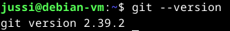
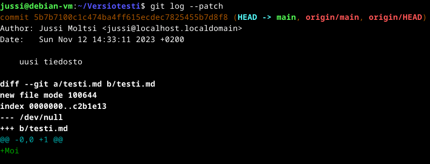
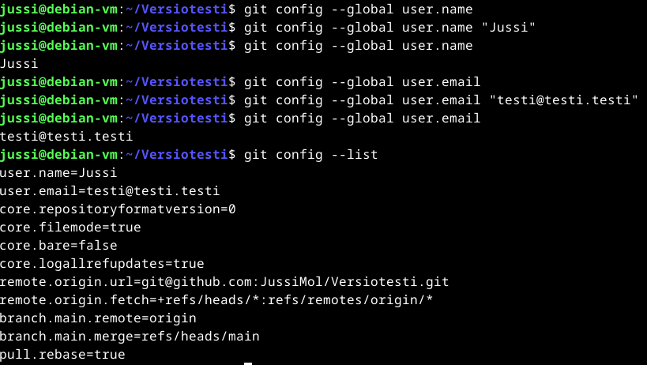

# H3 Versio
### a) Online
Your Repositories sivulta painetaan vihreää painiketta New ja syötetään repon tiedot.  
 

 
Create Repository ja osio valmis.  
### b) Dolly
Teen osion osittain ulkomuistista ja ohjeita käytän kun tulee ongelmia. 
Katsotaan onko git valmiiksi jo asennettuna.  
 

 
Kloonaus linux terminaalista.  
 

 
Ei ole lupaa päästä käsiksi git repoon, täytyy luoda julkinen avain ja lisätä se githubin luotettuihin avaimiin.  
Luon julkisen avainparin.  
 

 
Avaimen julkinen puoli täytyy lisätä githubiin.  
Githubin oikea yläkulma paina avatarin kuvaa -> valikosta settings -> Access osiosta SSH and GPG keys.  
New SSH key ja copy pastetaan linux terminaalista julkinen puoli avaimesta.  
 

 
Kokeillaan kloonausta uudelleen.  
 

 
Ilmeisesti onnistui, testataan saadaanko tehtyä muutoksia.  
Käytän tässä muistin virkistämiseen https://github.com/joshnh/Git-Commands listan komentoja.  
Kotihakemistoon ilmestyi Versiotesti hakemisto. Siirryn sinne ja kokeilen git pull. Everything up to date.   
Teen testitiedoston. Tiedoston lisääminen $ git add testi.md ja perään git commit -m "uusi tiedosto"  
Sen jälkeen voidaan puskea tiedosto pilveen. $ git push  
 

 
Kuvassa on commit komennon alla kommentti jota ei tarvitse noteerata, ajoin komennot uudestaan nätimpää kuvaa varten.  
Tarkistetaan tuliko webbiliittymään mitään.  
 

 
Tiedosto lisätty onnistuneesti.  
### c) Doh!
Kissa käveli näppäimistöllä ja onnistui tekemään muutoksia testitiedostoon ja lisäämään sen $ git add testi.md komennolla.  
Perutaan muutokset $ git reset --hard komennolla (muistakaa ne välilyönnit) ja katsotaan korjautuiko tilanne.  
 

 
Onnistui.  
### d) Tukki
$ git log --patch
 

 
Kuvassa logista otettu kaappaus. Siitä voidaan nähdä kuka on tehnyt muutoksia ja milloin. 
< jussi@localhost.localdomain > osasta voidaan nähdä mistä muutoksia on tehty (SSH-yhteys)  
"uusi tiedosto" on commit -m kommentti joka olisi suotavaa olla englanniksi.  
Kommentin alapuolisista tiedoista ei ole täyttä varmuutta, muuta kuin new file (uusi tiedosto)  
plus merkin jälkeen on nähtävillä lisäykset.  
Katsotaan käyttäjän tiedot. Mikäli ymmärsin <a href="https://stackoverflow.com/questions/46941346/how-to-know-the-git-username-and-email-saved-during-configuration"> config kysymyksen ja vastauksen </a> oikein niin $ git config --global user.name tai user.email on kysely ja $ git config --global user.name "nimi" on lisäys. Testataan  
 

 
Näyttäisi olevan "oikeat" tiedot.  
