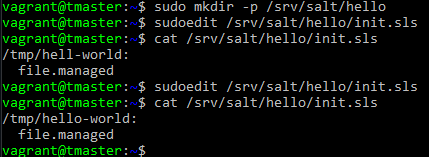
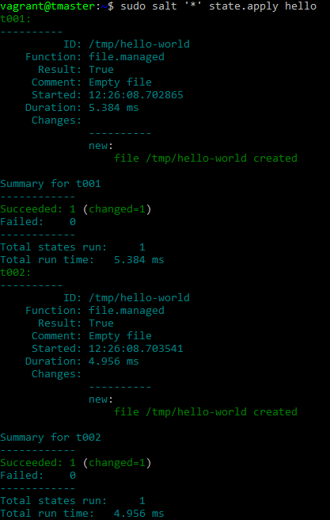
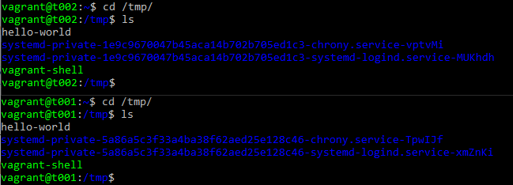
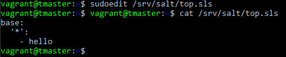
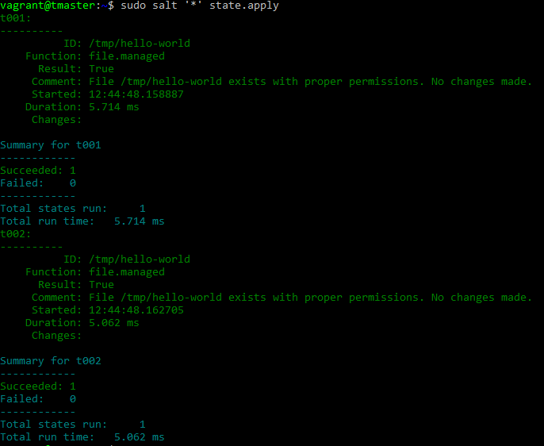
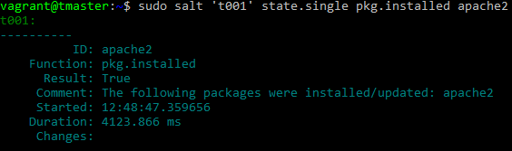
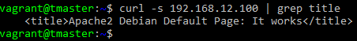
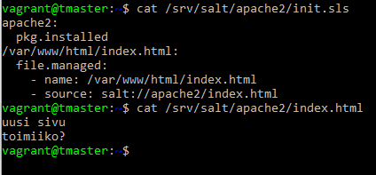
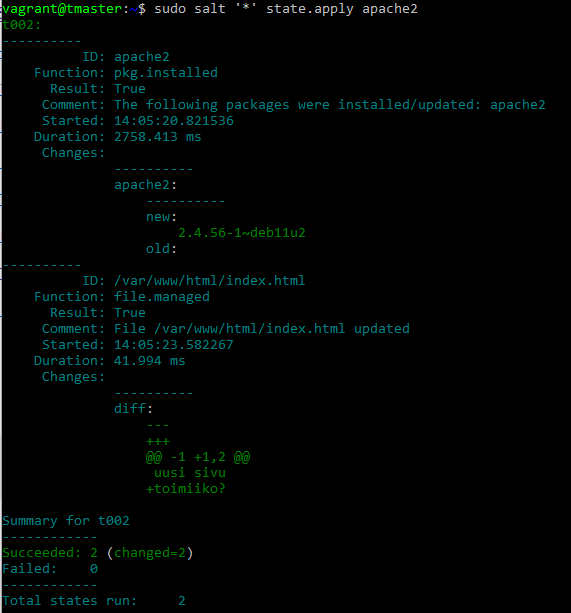
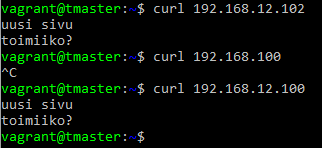

# Demonit
Tehtävänanto H4 demonit https://terokarvinen.com/2023/configuration-management-2023-autumn/
## x) Tiivistelmät
### Salt vagrant
init.sls tiedosto sisältää käskyt toteutettaville tiloille. 
top tiedosto määrittää mitkä koneet ajavat mitäkin tiloja. 
### Salt overview
#### Rules of YAML
Data rakentuu (avain): (arvo) pareihin, jotka määrittyvät kaksoispisteellä.  
Arvoilla voidaan muuttaa toimintoja.  
Syntaksi on tarkkaa (pienet kirjaimet).  
Tabulaattorin käyttö kielletty, käytä välilyöntiä.  
Kommentit # merkin perään.  
#### YAML simple structure
Skalaari on avain: arvo pari. 
Lista on avain jonka alle sisennettynä 2 välilyönnillä tehdään lista.  
Kirjasto on kokoelma kahta edellä mainittua.  
#### Lists and dictionaries - YAML block structures
YAML on jaettu lohkorakenteisiin. 
Sisennys asettaa kontekstin. SINUN ON sisennettävä ominaisuudet ja listasi. Kaksi välilyöntiä on standardi. 
Kokoelma, joka voi olla lista tai sanakirja-lohkosarja, osoitetaan jokainen merkinnällä yhdysviiva ja välilyönti.
(Salt project, salt user guide)
### Salt states
#### State modules
Tila moduuleilla määritetään mitä halutaan suorittaa ajettavalla koneella. 
Moduuleissa on varottava ristiriitoja tai määriteltävä niitä syvemmin ettei tule ristiriitoja suorituksissa.  
#### The state SLS data structure
.sls tiedostoon määritellään tunniste, tila, funktio, nimi ja argumentit. 
#### Organizing states
Tilatiedostot tulisi kirjoittaa niin että toinen kehittäjä voi ymmärtää helposti ja vaivattomasti mitä tilat tekevät.  
Hyvä käytäntö vähentää tilatiedoston monimutkaisuutta on käyttää vain muutamaa sisennystä lohkoa kohti.  
#### The top.sls file
top.sls tiedostolla voidaan määrittää mille koneille ajetaan tiloja. Suurissa kokonaisuuksissa ei ole käytännöllistä ajaa monia tiloja yksittäisinä.  
Tiedostolla voidaan myös määritellä erilaisia solmuja ja poimia ajettavia tiloja eri tiedostoista.  
Tiedoston sisältö ja rakenne kannattaa olla mahdollisimman joustava ja yksinkertainen.  
#### Create the SSH state, Create the Apache state
Tiedostot näyttävät siltä ettei ne päivity muutosten tekemisen yhteydessä.  
(Salt project, salt user guide)
### Pkg-File-Service
Artikkelissa on sshd tilan rakenne sekä määritystiedoston sisältö.  
(Tero Karvinen, Pkg-File-Service – Control Daemons with Salt – Change SSH Server Port)  
## a,b) Hello SLS! Top
Aloitan luomalla vagrantilla herran ja kaksi orjaa. Ympäristön luomisen jälkeen ssh yhteydellä herralle. 
Hyväksyn avaimet 'sudo salt-key -A'. Testaan kuuleeko orjat 'sudo salt '*' test.ping'  
Orjat vastaavat.
 

Seuraan <a href="https://terokarvinen.com/2023/salt-vagrant/#infra-as-code---your-wishes-as-a-text-file"> Teron ohjeita </a> init.sls ja top.sls tiedostojen luomisessa.  
Luon komennolla 'mkdir -p /srv/salt/hello' hakemiston. (-p = luo puuttuvat ylähakemistot samalla(parent directory))  
 

 
tilatiedostolla luodaan hello-world niminen tiedosto orjille. Testataan toiminta.  
 

 
Orjat väittää luoneensa tiedoston, käydään tarkistamassa tilanne.  
 

 
Tiedostot on luotu, tilatiedosto toimi halutusti.  
Kokeillaan top.sls tiedoston toimintaa.  
 

 
Tällä tiedostolla määritellään kaikille orjille ajettavaksi tila nimeltä "hello".  
Kokeillaan uudestaan ajaa tila 'sudo salt '*' state.apply'
 

 
Sama tila ajettiin uudestaan onnistuneesti, ei muutoksia.  
### c) Apache
Ajan herralla komennon 'sudo salt 't001' state.single pkg.installed apache2' tämä komento käskee orjaa asentamaan apache2 paketit.  
 

 
Pitkä litania uusia muutoksia ja alhaalla lukee succeeded (changed=1), katsotaan onko asentunut ja mennyt päälle.  
Kysytään ip-tiedot orjilta ' sudo salt '*' cmd.run 'hostname -I' '  
t001 192.168.12.100  
Kokeillaan curlata t001 osoitetta. 
 

 
Apache2 on asennettuna ja päällä koneella.  
Poistetaan ja testataan että apache poistui.  
'sudo salt 't001' state.single pkg.removed apache2' (changed=1)  
curlilla testi -> connection refused.  
Poistettu onnistuneesti.  
Sitten kokeillaan automatisoida. (olen aiemmin jo tehnyt itse sivuja apachelle ja käynnistellyt/sulkenut sitä.)  
Mikäli nyt tulkitsin <a href="https://docs.saltproject.io/salt/user-guide/en/latest/topics/states.html#create-the-apache-state">Salt state ohjeita </a> oikein niin voin herra koneelle tehdä /srv/salt/apache2/index.html ja käyttää sitä tilatiedostossa määrittelemään minkälainen sivu tehdään.  
Teen uuden sivun ja uuden init.sls tiedoston hakemistoon /srv/salt/apache2.  
 

 
Ylempi kuva on korjattu versio init.sls tiedostosta.
Kokeilin kerran ajaa ja se ei onnistunut, yksi välilyönti oli liikaa ennen file.managed: kohtaa.  
Kokeillaan uudestaan ajaa tilatiedosto ja toivotaan parasta.  
 

 
Molemmilla koneilla Succeeded: 2(changed=2) tarkistetaan mitä curlaamalla mitä käy.  
 

 
Apachen asennus onnistui ja uuden sivun luonti siinä samassa.  
### d) SShouto
