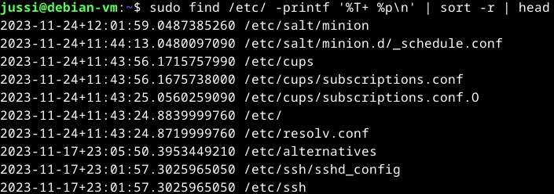
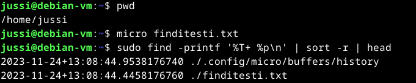
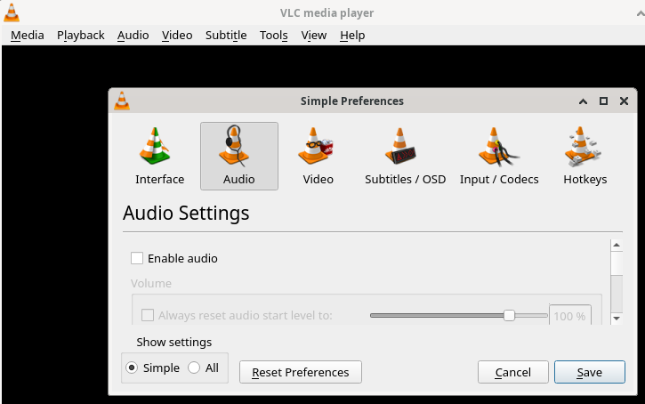
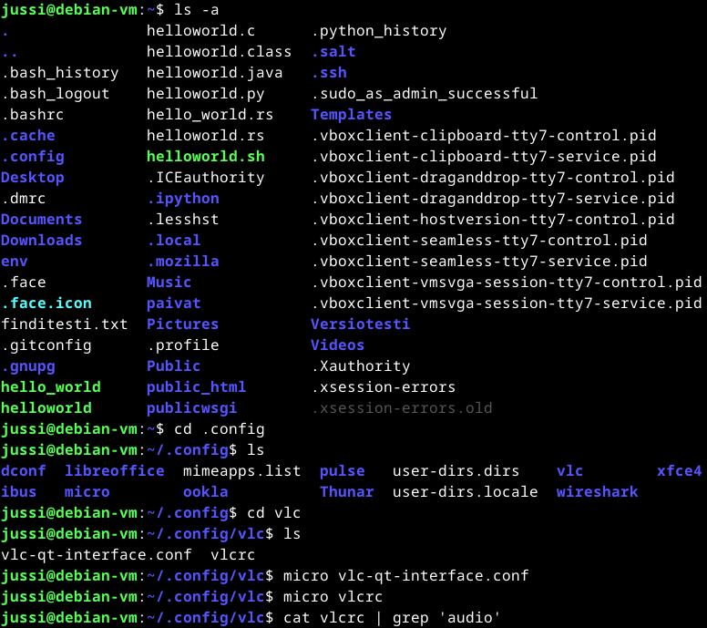
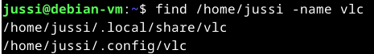
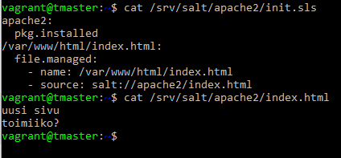

#H5 CSI Kerava
Tehtävänanto. https://terokarvinen.com/2023/configuration-management-2023-autumn/#h5-csi-kerava
### x) Tiivistelmä
#### Apache User Homepages Automatically – Salt Package-File-Service Example
- Tee ensin käsin, automatisoi vasta sen jälkeen.
- Selvitä mitä tiedostoja muokkasit, sudoeditillä tehdyt muokkaukset huomaa helposti.
- Kun luot tiloilla tiedostoja, tee niistä idempotentteja.
- Tiedostojen käyttö on luotettavampaa kuin shell komentojen ajaminen.
- Jos jokin ei toimi saattaa joutua tarkistamaan hakemistojen ja tiedostojen oikeudet.
### a) CSI Kerava
Nyt ollaan tekemisissä työkalun kanssa, jota en ole käyttänyt kertaakaan. Aloitan selaamalla manuaalisivuja ja selaamalla nettiä.  
<a href="https://www.tecmint.com/35-practical-examples-of-linux-find-command/">35 esimerkkiä</a> find komennosta, näistä sai käsitystä miten tuota komentoa tulisi kasata. 'man find' etsitään selitykset ja kokeillaan tehtävänannon vinkeissä olevaa find komentoa.  
Teen ensiksi muutoksen /etc/salt/minion tiedostoon. Tapahtuma 24.11.2023 noin kello 12. Kokeillaan etsiä tapahtuma lokista. 
$ sudo find /etc/ -printf '%T+ %p\n' | sort -r | head
- sudo = pääkäyttäjänoikeuksilla (oletan että kaikkea ei paljasteta normaalille käyttäjälle)
- find = etsimiskomento
- /etc/ = tiedostopolku mistä etsitään
- -printf = määrittää minkälaisen merkkijonon komento tulostaa -> liittyy seuraavaan osaan.
- %T+ = muokkauspäivämäärä ja aika tarkemmalla esitystavalla (plus merkki)
- %p = näytä tiedostopolku
- \n = newline - rivinvaihto
- sort -r = lajittelee tulokset tulokset aikajärjestyksessä käänteisesti (uusin ylimpänä)
- head = näyttää uusimmat 10 riviä

Ylimmäisenä nähdään minun muokkaus minion tiedostoon.   
 

 
The time is given in the current timezone (man find) Aikaleimoja tarkastellessa täytyy olla tarkkana.  
Kokeillaan sama setti mutta ilman /etc/ osaa ja ollaan kotihakemistossa. Jos komento toimii kuten luulen niin se toimii myös tällä tavalla.  
Teen nopeaan testitiedoston findia varten noin kello 13.07.  
 

 
Toimiihan se. ./ on /etc/ tai /home/ tilalla kertomassa että komento ajettiin tämänhetkisessä hakemistossa. Tiedostokin on nähtävissä. 
### b) Gui2fs
Virtuaalikoneelle on ladattu VLC Media Player, muokkaan sitä ottamalla audion pois käytöstä.  
 

 
Internetistä löydetyn tiedon mukaan <a href="https://stackoverflow.com/questions/1024114/location-of-ini-config-files-in-linux-unix">konffi tiedostojen</a> sijainti on joko /etc/ tai käyttäjän kotihakemistossa piilotettuna.  
Tein muutoksen ilman sudoa, omalla käyttäjällä ja sovelluksesta suoraan.  
Oletan että konffitiedosto löytyy kotihakemistosta.  
'ls -a' komento näyttää piilotetut tiedostot ja hakemistot. Siirrtyään .config hakemistoon ja etsitään mitä löytyy.  
 

 
Tämä näyttäisi olevan sama tiedosto. Grepillä sai lyhennettyä tulostetta, enable audio boolean arvo näyttäisi olevan false.  
Voisin olettaa että oikea tiedosto paikannettu.  
find toiminnolla löysin seuraavalla tavalla melkein samaan paikkaan.  
 

 
### c) Komennus
Käytän seuraavissa tehtävissä tmaster, t001 ja t002 ympäristöä.  

### d) Apassi
Tilatiedostossa on määriteltynä apache2 asennus.  
/var/www/html/index.html määritellään file.managed moduulilla.  
name kohta määrittelee tiedostopolun ja source mitä tiedostoa käytetään name kohdan tiedostopolussa.  
(Salt states, user guide)  
 

 

### Lähteet
https://stackoverflow.com/questions/1024114/location-of-ini-config-files-in-linux-unix
