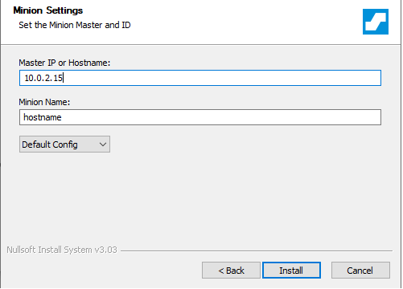
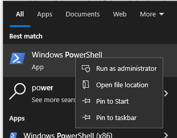
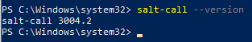

# H6 Windows
### Tehtävänanto
https://terokarvinen.com/2023/configuration-management-2023-autumn/#h6-windows
### x) Tiivistelmät
#### Installing Windows 10 on a virtual machine
- Valitse ja lataa asennettava levykuva.
- Aloita asennus määrittämällä virtuaalikoneen speksit ja asennuspolku
- Määritysten jälkeen tarkista kaikki ja käynnistä virtuaalikone asennusta varten
- Hyväksy lisenssit yms. Valitse asennusikkunassa haluamasi näppäimistö, kieli ja aika asetukset
- Käytä "domain login" näin säästyt paljolta Microsoftin käyttäjätili veivaamiselta.
- Määritä kirjautumistiedot ja odota kunnes asennusohjelma on valmis
#### Filesystem Hierarchy Standard
- / root - kaikista tärkein ja ylin hakemisto.
- /usr - jaettavaa read-only dataa
- /usr/bin - hakemisto kaikille käyttäjille ajettavista komennoista
- /home - käyttäjien kotihakemisto
- /etc -  sisältää ohjelmien asetustiedostoja ja konfiguraatiotiedostoja.
- /var - vaihtelevaa dataa
### a) Asennus
Asensin Virtuaalikoneen Windows 10 Enterprise versiolla luennolla 28.11.  
Asennuksessa seurasin Halonen, Rajala ja Ollikainen 2023: <a href="https://github.com/therealhalonen/PhishSticks/blob/master/notes/ollikainen/windows.md">Installing Windows 10 on a virtual machine</a> ohjetta.  
Ainut muutos mitä tein ohjeisiin on kovalevytila, jota laitoin virtuaalikoneelle 20GB koska isäntäkoneella alkaa olla tallennustila niukilla.  
### b) Salt Windowsilla
Asennuspaketti https://docs.saltproject.io/en/3004/topics/installation/windows.html, valitsen Python3 AMD64 version.  
Asennusohjelmassa klikkaillaan aika pitkälti nextiä, poikkeuksena asennuspolku (jos haluat muuttaa) ja seuraava vaihe.  
 

 
Tähän kohtaan laitetaan haluamasi masterin ip4 osoite. Tässä tapauksessa virtuaalikoneen mihin salt asennetaan.  
Asennusohjelma on valmis, testataan toimintaa Powershellistä.  
Windowsin hakupalkkiin powershell hakuun, mouse2 ikonin päällä ja run as administrator.  
 

 
Testi onko ohjelma asennettu  
 

 
