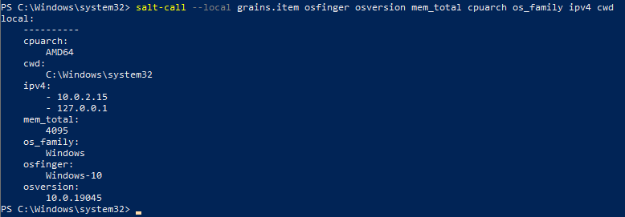

# H6 Windows
### Tehtävänanto
https://terokarvinen.com/2023/configuration-management-2023-autumn/#h6-windows
### x) Tiivistelmät
#### Installing Windows 10 on a virtual machine
- Valitse ja lataa asennettava levykuva.
- Aloita asennus määrittämällä virtuaalikoneen speksit ja asennuspolku
- Määritysten jälkeen tarkista kaikki ja käynnistä virtuaalikone asennusta varten
- Hyväksy lisenssit yms. Valitse asennusikkunassa haluamasi näppäimistö, kieli ja aika asetukset
- Käytä "domain login" näin säästyt paljolta Microsoftin käyttäjätili veivaamiselta.
- Määritä kirjautumistiedot ja odota kunnes asennusohjelma on valmis
#### Filesystem Hierarchy Standard
- / root - kaikista tärkein ja ylin hakemisto.
- /usr - jaettavaa read-only dataa
- /usr/bin - hakemisto kaikille käyttäjille ajettavista komennoista
- /home - käyttäjien kotihakemisto
- /etc -  sisältää ohjelmien asetustiedostoja ja konfiguraatiotiedostoja.
- /var - vaihtelevaa dataa
### a) Asennus
Asensin Virtuaalikoneen Windows 10 Enterprise versiolla luennolla 28.11.  
Asennuksessa seurasin Halonen, Rajala ja Ollikainen 2023: <a href="https://github.com/therealhalonen/PhishSticks/blob/master/notes/ollikainen/windows.md">Installing Windows 10 on a virtual machine</a> ohjetta.  
Ainut muutos mitä tein ohjeisiin on kovalevytila, jota laitoin virtuaalikoneelle 20GB koska isäntäkoneella alkaa olla tallennustila niukilla.  
### b) Salt Windowsilla
Asennuspaketti https://docs.saltproject.io/salt/install-guide/en/latest/topics/install-by-operating-system/windows.html#install-windows, valitsen Python3 AMD64 version.  
Asennusohjelmassa klikkaillaan aika pitkälti nextiä, poikkeuksena asennuspolku (jos haluat muuttaa) ja seuraava vaihe.  
 

 
Tähän kohtaan laitetaan masterin ip4 osoite. Tässä tapauksessa virtuaalikoneen mihin salt asennetaan.  
Asennusohjelma on valmis, testataan toimintaa Powershellistä.  
Windowsin hakupalkkiin powershell hakuun, mouse2 ikonin päällä ja run as administrator.  
 

 
Testi onko ohjelma asennettu  
 

 
### c) Tiedot
Etsitään tietoja koneesta, ajan ensin grains.items ja poimin sieltä olennaista tietoa. 
grains.item perään alla tuloste.  
 

 
Prosessorin arkkitehtuuri: AMD64  
cwd: current working directory  
ipv4 osoitteet 10.0.2.15 reitityksessä käytettävä osoita ja 127. alkuinen on localhost.  
mem_total: Käytettävän RAM muistin määrä megatavuina virtuaalikoneella (hostilla on 4 kertainen määrä)  
os_family: Käyttöjärjestelmän tuoteperhe  
osfinger: Käyttöjärjestelmä tarkemmin 
osversion: Käyttöjärjestelmän tarkka versio. 
Kunniamaininta, jota en älynnyt sisällyttää komentoon.  
num_cpus: 4 prosessoriytimien määrä virtuaalikoneessa   
### d) Salt file
Testataan tiedoston luomista.  
 

 
Virheilmoituksesta voisin päätellä että windows vaatii polun tiedoston tekemiselle.  
Määritetään se suoraan C hakemiston alle.  
 

 
Virheilmoituksesta saa hyvin kiinni missä ongelmat piilee ja tiedosto ilmestyi minne haluttiin.  
### e) Uusi toiminto
Kokonaan uutta toimintoa on hieman vaikea keksiä. Kokeilen kumminkin hyödyllistä <a href="https://docs.saltproject.io/en/latest/topics/windows/windows-package-manager.html#list-installed-packages">toimintoa</a>. 
 

 
Itse asennetut paketit ovat virtualboxin guest additions ja salt.  
 
Reilu tunti surffailua ja eri lähteiden lukemista. Yritin tehdä vapaaehtoisia tehtäviä ja kaikissa samanlainen ongelma. 
Luen vertaisarviointeja ja katson mistä kiikastaa.  
***Tein tilatiedostoja paikallista ajamista varten. Niitä ei pitäisi tarvita*** 
### Lähteet
### Tero Karvinen
#### Tehtävänanto
https://terokarvinen.com/2023/configuration-management-2023-autumn/#h6-windows
### LSB Workgroup, The Linux Foundation
#### Filesystem Hierarchy Standard
https://refspecs.linuxfoundation.org/FHS_3.0/fhs/index.html
### Halonen, Rajala ja Ollikainen
#### Installing Windows 10 on a virtual machine
https://github.com/therealhalonen/PhishSticks/blob/master/notes/ollikainen/windows.md
### Salt Project
#### Windows Package Manager
https://docs.saltproject.io/en/latest/topics/windows/windows-package-manager.html#list-installed-packages
#### Salt Windows asennusohjelma
https://docs.saltproject.io/salt/install-guide/en/latest/topics/install-by-operating-system/windows.html#install-windows
