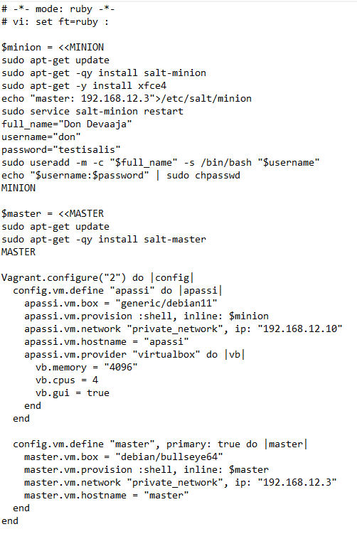
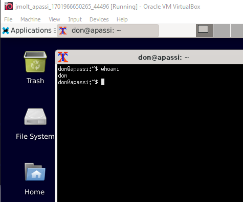

#H7 Oma moduuli
### Tavoitetila
Moduulin tavoitteena on luoda vagranttia käyttäen kahden koneen herra/orja arkkitehtuuri. 
Tarkoitus olisi masteria käyttäen luoda orjalle ympäristö verkkosivujen luomiseen ja mahdollistaa selaimella niiden tarkastelu. 
### Lähtötiedot
#### Isäntäkone
OS: Windows 10 Home 64-bit 
CPU: AMD Ryzen 5 5600x 6-core 
RAM: 16Gb 
#### Master kone.  
Debian 11 kone salt-master asennettuna provisioinnin yhteydessä. 
#### Debian 11 kone  
Minion shell skriptissä asennetaan salt-minion. 
Asennetaan xfce4 joka on <a href="https://www.xfce.org/">kevyt työpöytäympäristö</a>.  
Lisätään käyttäjä don.  
Koneelle asennetaan graafinen käyttöliittymä sekä enemmän prosessointitehoa ja RAM muistia.  
 

  
 
Vagrant tiedostoon on saatu pohja Tero Karvisen <a href="https://terokarvinen.com/2023/salt-vagrant/#ready-made-Vagrantfile-for-three-computers">Vagrant artikkelista</a>. Muokkasin tiedostoa hieman ja tein omat lisäykset.  
Ympäristön käyttöönotto 'vagrant up' komennolla.  
Asennuksen jälkeen testataan ensimmäiseksi apassi koneelle kirjautuminen don käyttäjällä.  
 

 
 
Kirjautuminen onnistuu, siirryn työskentelemään isäntäkoneen komentokehotteeseen masterille ssh-yhteydellä.  

https://terokarvinen.com/2023/salt-vagrant/#ready-made-Vagrantfile-for-three-computers  
https://stackoverflow.com/questions/18878117/using-vagrant-to-run-virtual-machines-with-desktop-environment  
