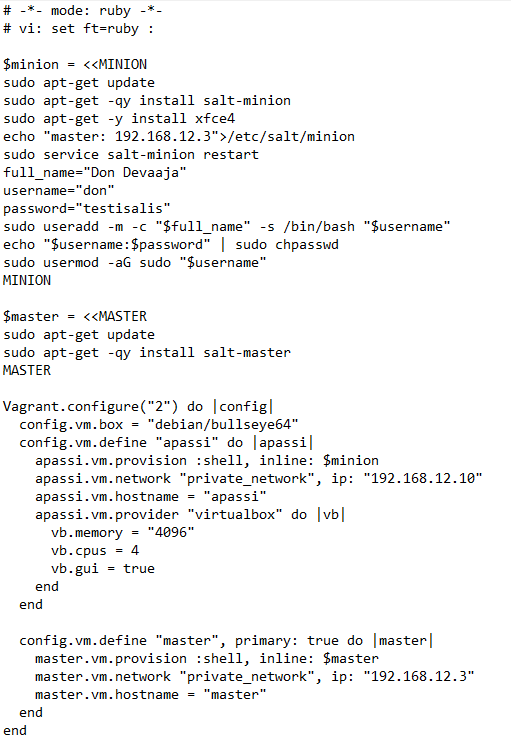
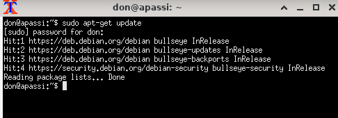
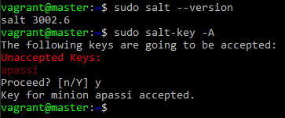
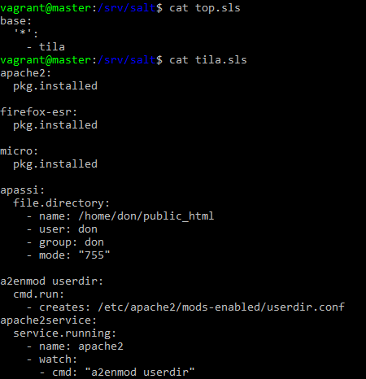
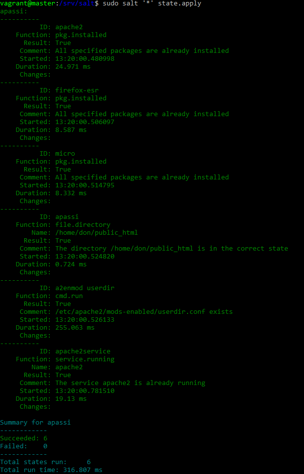
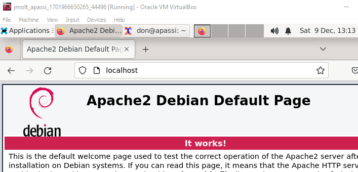
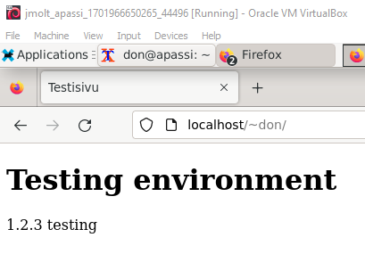
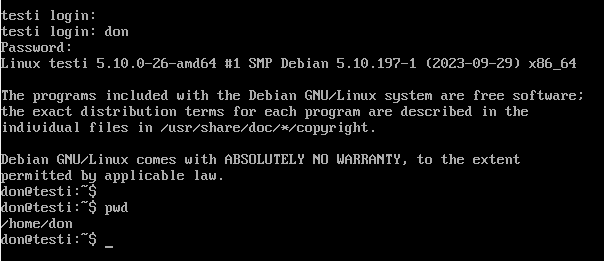

# H7 Oma moduuli, kehitysympäristö
### Tavoite
Moduulin tavoitteena on luoda vagranttia käyttäen kahden koneen herra/orja arkkitehtuuri. 
Herraa käyttäen luoda orjalle ympäristö käyttäjän verkkosivujen luomiseen, web-palvelimella niiden ylläpito ja mahdollistaa selaimella sivujen tarkastelu. 
### Lähtötiedot
#### Isäntäkone
OS: Windows 10 Home 64-bit 
CPU: AMD Ryzen 5 5600x 6-core 
RAM: 16Gb 
#### Master kone.  
Debian bullseye 11 kone salt-masterilla asennuksen yhteydessä. 
#### Minion kone  
Debian bullseye 11 
Minion shell skriptissä asennetaan salt-minion. 
Asennetaan xfce4 joka on <a href="https://www.xfce.org/">kevyt työpöytäympäristö</a>.  
Lisätään käyttäjä don sudo oikeuksilla.  
Koneelle asennetaan graafinen käyttöliittymä sekä enemmän prosessointitehoa ja RAM muistia.  
 
Mikäli koneita olisi enemmän niin don luotaisiin jokaiselle minionille. Harkitse teetkö näin vai user.present funktiolla.  
 
Käyttäjien hallinnointiin virkistin muistia <a href="https://www.freecodecamp.org/news/how-to-manage-users-in-linux">FreeCodeCampin</a> linux artikkelista.  
Vagrant tiedostoon on saatu pohja Tero Karvisen <a href="https://terokarvinen.com/2023/salt-vagrant/#ready-made-Vagrantfile-for-three-computers">Vagrant artikkelista</a>. Muokkasin tiedostoa hieman ja tein omat lisäykset.  
 
 

  
 
***Miksi lisätä käyttäjä provisioinnissa eikä tilatiedostolla?***  
***user.present/absent käyttäjien hallinta on tuttua, halusin kokeilla muuta lähestymistapaa.***  
 
Puran hieman omia lisäyksiä auki.  
 useradd - käyttäjänlisäys 
 (-m) luo käyttäjän kotihakemiston 
 (-c $full_name) määrittää käyttäjän koko nimen "Don Devaaja" 
 (-s /bin/bash) määrittää käyttäjän oletuskomentotulkin (bash) 
 $username määrittää käyttäjän joka lisätään järjestelmään.  
 echo"$username:$password" | sudo chpasswd - komento päivittää käyttäjän salasanan ylempänä annetulla "testisalis" arvolla.  
 sudo usermod -aG sudo "$username" - lisätään "don" ryhmään sudo.  
  
 Käyttäjän lisäykseen saatu vinkkejä kaverilta, joka on Linuxin kanssa tekemisissä päivittäin.  
 Osien selitykset poimittu 'man useradd' manuaalisivuilta.  
  
Ympäristön käyttöönotto 'vagrant up' komennolla.  
Asennuksen jälkeen testataan ensimmäiseksi apassi koneelle kirjautuminen don käyttäjällä sekä sudo oikeudet.  
 

 
 

 
 
Kirjautuminen onnistuu, siirryn työskentelemään isäntäkoneen komentokehotteeseen masterille ssh-yhteydellä.  
Master koneella testi onko salt asennettu ja avaimien hyväksyminen 'sudo salt-key -A'
 
 

 
 
'sudo mkdir /srv/salt' hakemiston luonti mihin tilatiedostot sijoitetaan.  
Luon vanhoja muistiinpanojani sekä Tero Karvisen <a href="https://terokarvinen.com/2018/04/03/apache-user-homepages-automatically-salt-package-file-service-example/">Apache PFS esimerkkiä</a> hyödyntäen top.sls ja tila.sls tiedostot.  
 

 
 
Tila.sls osat.  
apache2 / firefox-esr / micro - pakettien asennus.  
apassi - don käyttäjälle public_html hakemiston luonti ja sen käyttöoikeuksien määrittäminen.  
a2enmod userdir - otetaan apachen vakiotiedosto userdir.conf käyttöön joka mahdollistaa kotihakemistosta html sivujen käyttämisen.  
apache2service - pitää palvelun päällä ja seuraa muutoksia userdir.conf tiedostossa. Tarpeen mukaan käynnistää apachen uudestaan.  
 
Tilan ajaminen komennolla 'sudo salt '*' state.apply' 
Kuva otettu toisesta tilatiedoston ajokerrasta, jotta kaikki saadaan nätisti yhteen kuvaan.  
Tilan ajaminen on onnistunut ilman virheitä, niistä tulisi ilmoitukset kunkin epäonnistuneen kohdan yhteydessä.  
Muutokset ilmoitettaisiin myös niissä kohdissa, joissa muutoksia tehdään.  
Succeeded: 6 perässä lukisi (changed:(numero)) riippuen kuinka monta muutosta tapahtuu.  
 

 
 
Seuraavaksi tarkistus apassi koneelta onko Firefox selain ja apache2 asennettuna.  
 

 
 
Loin manuaalisesti Microlla don käyttäjällä /home/don/public_html/index.html sivun ja katsotaan selaimella näkyykö se. 
 

 
 
Nyt on luotu ympäristö tarvittavilla sovelluksilla sekä käyttäjällä verkkosivujen luomiseen.  
Git ja virtualbox guest additions olisi ollut hyvä lisä näin jälkiviisaana.  
Mitä idempotenssiin tulee niin tässä tapauksessa tarvittavien ohjelmien olemassaolo, sekä käyttäjän mahdollisuus luoda omia kotisivuja ovat se tila mitä halutaan pitää yllä.  
Mielestäni tavoite on saavutettu. Automaatiolla rakennettiin ympäristö, joka mahdollistaa manuaalisen työskentelyn ja testauksen.  
 
Virtuaalikone ilman työpöytäympäristöä. Kuva otettu rakentamis/ongelmanratkaisu vaiheesta.  
 

 
 
xfce4 on löydetty Googlesta haulla linux desktop environments.  
Haun päällimmäisenä oli <a href="https://www.geeksforgeeks.org/best-linux-desktop-environments/">GeeksforGeeks</a> artikkeli Linux työpöytäympäristöistä.  
Päädyin käyttämään kyseistä ympäristöä koska siitä puhuttiin laitteistolle kevyenä ja käyttäjäystävällisenä.  
Tarkistin valmiilta Linux virtuaalikoneelta löytyykö tuo paketinhallinnasta.  
'sudo apt search xfce' ja sieltä löytyi metapaketti ja kaikki liitännäiset.  
### Kotitehtävät
https://github.com/JussiMol/Palvelinten-hallinta/blob/main/h1/Viisikko.md  
https://github.com/JussiMol/Palvelinten-hallinta/blob/main/h2/Karjaa.md  
https://github.com/JussiMol/Palvelinten-hallinta/blob/main/h3/Versio.md  
https://github.com/JussiMol/Palvelinten-hallinta/blob/main/h4/Demonit.md  
https://github.com/JussiMol/Palvelinten-hallinta/blob/main/h5/CSIKerava.md 
https://github.com/JussiMol/Palvelinten-hallinta/blob/main/h6/Windows.md  
### Lähteet
#### Tero Karvinen
Salt Vagrant - automatically provision one master and two slaves  
https://terokarvinen.com/2023/salt-vagrant/#ready-made-Vagrantfile-for-three-computers  
Apache User Homepages Automatically – Salt Package-File-Service Example  
https://terokarvinen.com/2018/04/03/apache-user-homepages-automatically-salt-package-file-service-example/  
#### Stack overflow
Using vagrant to run virtual machines with desktop environment 
https://stackoverflow.com/questions/18878117/using-vagrant-to-run-virtual-machines-with-desktop-environment  
#### Xfce Development Team
https://www.xfce.org/
#### FreeCodeCamp
How to Manage Users in Linux 
https://www.freecodecamp.org/news/how-to-manage-users-in-linux/ 
#### GeeksforGeeks
Best Linux Desktop Environments  
https://www.geeksforgeeks.org/best-linux-desktop-environments/ 
